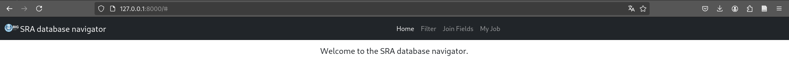

<!-- TODO: escrever manual -->
# SRA Database Navigator
SRA Database Navigator is a computational [Python](https://www.python.org/) package
designed to explore the metadata of sequenced samples stored in the [Sequence Read Archive](https://www.ncbi.nlm.nih.gov/sra)
(SRA). This package helps you locate and group samples sharing the same characteristic by comparing both structured
and unstructured metadata annotated in the SRA. The package constructs relational databases in the
[PostgreSQL](https://www.google.com/url?sa=t&source=web&rct=j&opi=89978449&url=https://www.postgresql.org/&ved=2ahUKEwiwp7GPjIKKAxXFrJUCHX12CxkQFnoECA4QAQ&usg=AOvVaw0He1mmeTUi_lhXjiRGJtzr)
Database Management System (DBMS).
You can integrate Python modules into your project or use the scripts to download SRA metadata, construct local
databases, normalize sample metadata, and integrate and filter samples into networks.
For detailed methodology, please consult the article.<!-- TODO: inserir link para o artigo. -->

## 📋 Dependencies
Python 3.10 or higher and python lybraries described into [requirements.txt](./requirements.txt) file.

## 🔧 Instalação
The simplest way to install the project's dependencies is through the [Pip](https://pypi.org/project/pip/) module. 
On a device with Python3 installed, execute the command below to install all the necessary dependencies.
```shell
pip install -r requirements.txt 
```
If you wish to keep the installation isolated in a virtual environment, you can use the venv module to create the 
environment, activate it, and install the dependencies separately. Replace <virtual_environment_name> with the name of
your virtual environment. If you prefer, you can perform the same operations using your [Conda](https://anaconda.org/anaconda/conda)
environment or in your preferred IDE.
```shell
# creating virtual environment.
python -m venv <virtual_environment_name>
# loading virtual environment.
source <virtual_environment_name>/bin/activate
# intall dependencies.
pip install -r requirements.txt 
```
It is common for both Python versions 2 and 3 to coexist on many systems. If version 3 is not the default version on 
your system, replace the commands 'python' and 'pip' with 'python3' and 'pip3', respectively.

## 🚀 Usage
The execution of this package involves three main steps: downloading the data from the SRA, indexing the data, and
constructing feature networks of the samples.
### 💾 Download data
The location and transfer of the SRA data, as well as the construction of the database, are carried out using the script
[sra.py](./database/sra.py), located in the directory [database/data/sra.py](database/sra.py).
To construct the database, you can execute the command "sra.py --database <database_name> --query <SRA Query in Entrez Standard>".
```shell
# Use NCBI Entrez standard.
# Querying NCBI SRA and store data into local database. 
sra.py --database my_happy_database --query '(acute lymphoblastic leukemia) AND "Mus musculus"[orgn:__txid10090]'
# Querying NCBI SRA and store data into database in another machine.
sra.py --host <server address> --port <server port> --user <server user> --database <server database name> --query <Entrez SRA query>
```
Consult the documentation using the --help option.
```shell
# Visualizando opções de comando no script. 
sra.py --help
```
### 🔍 Data indexing
Create a configuration file named "config.ini" with the database connection details. An example file is available at
[config.ini.example](database/config.ini.example).
```ini
; Config model for packages.
[database]
host=localhost
port=5432
user=user
name=database_name
password=top_secret
```

To index the data in the local database, execute the script [prepare_database.py](database/prepare_database.py).
```shell
prepare_database.py
```
### Network process
After indexing the local database, you can use the query interface to customize the system's functionality and query the
data.
#### Web tool
You can use the script manage.py[manage.py](database/web/manage.py) to start the local web server. On a local machine, run one of the following commands:
```shell
# To run the web server only on a local machine, use the following command:
manage.py runserver

# To run the web server on a specific address, use the following command:
manage.py runserver <address>:<port>

# To run the web server into all local network, use the following command:
manage.py runserver 0.0.0.0:<port>
```
Caso deseje disponibilizar a ferramenta vai acesso servidor web, você pode fazê-lo utilizando servidores web como o
[Apache HTTP Server](https://httpd.apache.org/). Para configurar integrar a ferramenta web em seu servidor apache,
você pode incluir as diretivas abaixo. Consulte as documentações do Apache HTTP e do [Django Framework](https://www.djangoproject.com/).
```
WSGIScriptAlias / /path/to/mysite.com/mysite/wsgi.py
WSGIPythonHome /path/to/venv
WSGIPythonPath /path/to/mysite.com

<Directory /path/to/mysite.com/mysite>
<Files wsgi.py>
Require all granted
</Files>
</Directory>
```
##### Running the tool
Then, access the chosen address in an updated web browser. For example: http://127.0.0.1:8000/
<br/><br/>
##### Solving ambiguities
Due to the type of data, the indexing process may generate ambiguities, and therefore some terms may not be resolved 
automatically. In such cases, you should access the "Join Fields" menu and assess the detected ambiguities. If you agree
with the join, click the "Accept" button; otherwise, click the "Reject" button.
<br/><br/>
##### Querying database
Click on the "Filter" menu to search data in the integrated database. The target table is the table that stores the 
data you are searching for. The "Selected table filters" section displays the filters applied to the search. Filters 
are table attributes. When the goal is to use all the fields of the table, you can select the table itself instead of 
each individual field. Right-click on the attribute or table you want to select in the filter, then click on the "Add" 
option to include it in the search, or "Remove" to exclude it from the filter. It is also possible to remove fields and
tables from the search by clicking on the element in the "Selected table filters" section.
Click the "All fields" button to select all fields from all tables. The "Clear" button removes all previously selected fields.

<br/><br/>

When your filter is complete, click the "Get network" button to start the search.

<br/><br/>

Once the processing is complete, you will receive a summary of the results and will be able to download them for analysis on your computer.

<br/><br/>
<br/><br/>

The result is a set of files containing an index file (index.html) to be opened in a web browser, the file used to 
construct the network ("input_graph.csv"), as well as accessory data in CSV and JSON formats. The "query.json" file 
contains the details of the search performed and the time spent on execution.

<br><br/>

If you need to customize the construction of the network, hide labels, use parallel processing, or even achieve 
performance improvements in the network construction process, you can use the script [network.py](database/network.py).
Please, consult the `--help` option to see all the parameters.
```shell
network.py --input /tmp/teste/jobs/input_graph.csv --work_directory /tmp/rede/
```
